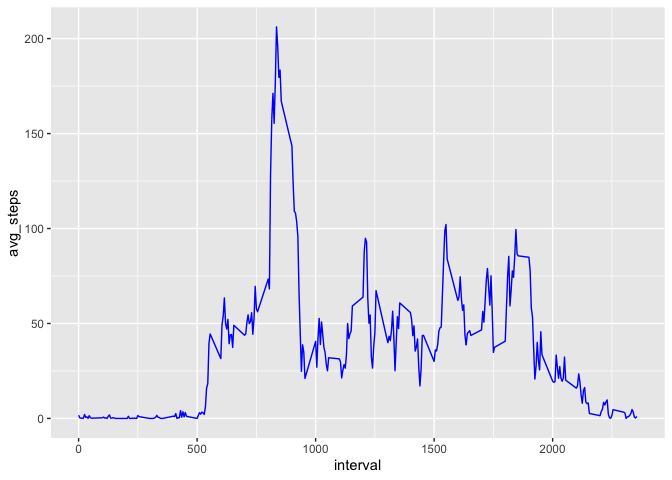

## Loading and preprocessing the data

```r
temp <- tempfile()
temp2 <- tempfile()

download.file("https://d396qusza40orc.cloudfront.net/repdata%2Fdata%2Factivity.zip",temp)
unzip(zipfile = temp, exdir = temp2)
data <- read.csv(file.path(temp2, "activity.csv"))

unlink(c(temp, temp2))
print("Lets start by looking at the data from a very high level")
```

```
## [1] "Lets start by looking at the data from a very high level"
```

```r
summary(data)
```

```
##      steps            date              interval     
##  Min.   :  0.00   Length:17568       Min.   :   0.0  
##  1st Qu.:  0.00   Class :character   1st Qu.: 588.8  
##  Median :  0.00   Mode  :character   Median :1177.5  
##  Mean   : 37.38                      Mean   :1177.5  
##  3rd Qu.: 12.00                      3rd Qu.:1766.2  
##  Max.   :806.00                      Max.   :2355.0  
##  NA's   :2304
```

## What is mean total number of steps taken per day?

```r
# 1. Calculate the total number of steps taken per day
totals <- data %>%
     mutate(date = date(date)) %>%
     group_by(date) %>%
     summarize(total_steps = sum(steps))

# 2. Make a histogram of the total number of steps taken each day
ggplot(data=totals, aes(x=date, y=total_steps)) +
    geom_histogram(stat="identity", fill="blue")
```

<!-- -->

```r
# 3. Calculate and report the mean and median of the total number of steps taken per day
sprintf("%f is the mean of total steps", mean(totals$total_steps, na.rm=TRUE))
```

```
## [1] "10766.188679 is the mean of total steps"
```

```r
sprintf("%f is the median of total steps", median(totals$total_steps, na.rm=TRUE))
```

```
## [1] "10765.000000 is the median of total steps"
```

## What is the average daily activity pattern?

```r
# 1. Make a time series plot (i.e. type = "l") of the 5-minute interval (x-axis) and the average number of steps taken, averaged across all days (y-axis)
avgs <- data %>% 
    group_by(interval) %>% 
    summarise(avg_steps = mean(steps, na.rm = TRUE)) 
ggplot(data=avgs, aes(interval, avg_steps)) + geom_line(color="blue")
```

<!-- -->

#### Interval with max average steps:

```r
# 2. Which 5-minute interval, on average across all the days in the dataset, contains the maximum number of steps?
avgs[which.max(avgs$avg_steps),]
```

```
## # A tibble: 1 x 2
##   interval avg_steps
##      <int>     <dbl>
## 1      835      206.
```

## Imputing missing values
1. Calculate and report the total number of missing values in the dataset (i.e. the total number of rows with NAs)

```r
nrow(filter(data, is.na(steps)))
```

```
## [1] 2304
```

2. Devise a strategy for filling in all of the missing values in the dataset. The strategy does not need to be sophisticated. For example, you could use the mean/median for that day, or the mean for that 5-minute interval, etc.

Will use mean of interval, work done in step 3

3. Create a new dataset that is equal to the original dataset but with the missing data filled in.

```r
idata <- data
for (row in 1:nrow(idata)) {
  if (is.na(idata[row,]$steps)) {
    idata[row,]$steps <- round(mean((filter(idata, interval == idata[row,]$interval))$steps, na.rm=TRUE))
  }
}
```
4. Make a histogram of the total number of steps taken each day and Calculate and report the mean and median total number of steps taken per day. Do these values differ from the estimates from the first part of the assignment? What is the impact of imputing missing data on the estimates of the total daily number of steps?

```r
itotals <- idata %>%
     mutate(date = date(date)) %>%
     group_by(date) %>%
     summarize(imputed_total_steps = sum(steps))
ggplot(data=itotals, aes(x=date, y=imputed_total_steps)) +
     geom_histogram(stat="identity", fill="blue")
```

<!-- -->

```r
sprintf("%f is the mean of total steps", mean(itotals$imputed_total_steps, na.rm=TRUE))
```

```
## [1] "10765.639344 is the mean of total steps"
```

```r
sprintf("%f is the median of total steps", median(itotals$imputed_total_steps, na.rm=TRUE))
```

```
## [1] "10762.000000 is the median of total steps"
```

```r
sprintf("imputing resulted in a mean of %f more steps per day", (mean(itotals$imputed_total_steps, na.rm=TRUE) - mean(totals$total_steps, na.rm=TRUE)))
```

```
## [1] "imputing resulted in a mean of -0.549335 more steps per day"
```

```r
sprintf("imputing resulted in a median of %f more steps per day", (median(itotals$imputed_total_steps, na.rm=TRUE) - median(totals$total_steps, na.rm=TRUE)))
```

```
## [1] "imputing resulted in a median of -3.000000 more steps per day"
```


## Are there differences in activity patterns between weekdays and weekends?

```r
tmp <- mutate(itotals, day=ifelse(weekdays(date, abbreviate=TRUE) %in% c("Mon","Tue","Wed","Thu","Fri"), "weekday", "weekend"))
ggplot(data=tmp, aes(x=date, y=imputed_total_steps)) +
  geom_line(color="blue", size=1) +
  geom_point(color="steelblue") +
  labs(title = "Total steps per day weekday vs weekend", y="Total steps", x="date") +
  facet_grid(day ~ .)
```

<!-- -->

Looking at the above graph it does not immediately become obvious that weekends are on average more active but comparing means of weekdays vs weekends makes it more clear


```r
mean(filter(tmp, day=="weekday")$imputed_total_steps)
```

```
## [1] 10255.29
```

```r
mean(filter(tmp, day=="weekend")$imputed_total_steps)
```

```
## [1] 12201
```
